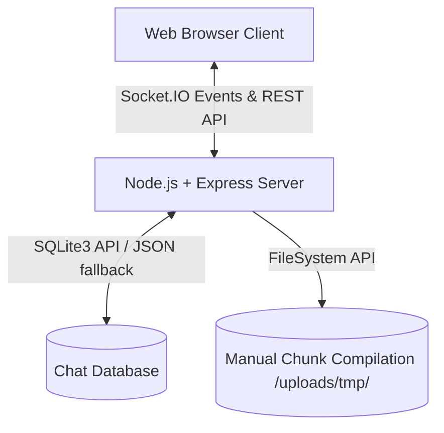
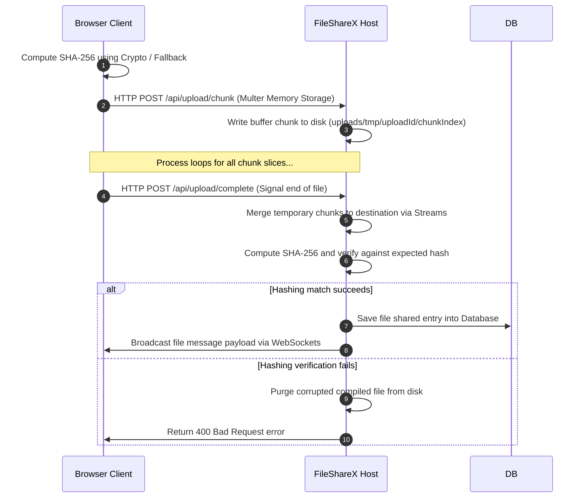
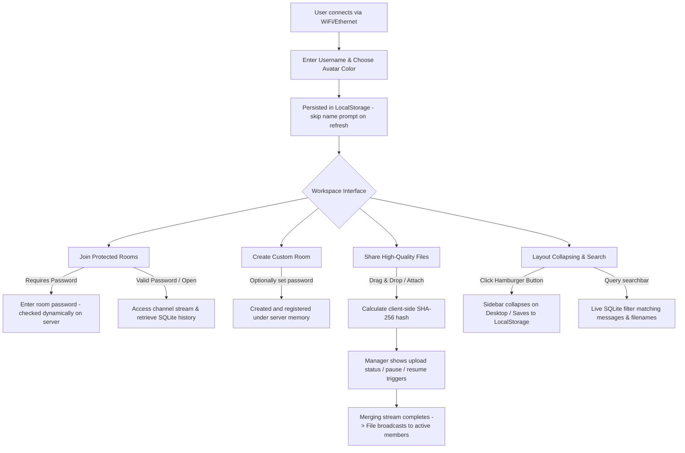

# 🌐 FileShareX

> **Premium, Ultra-Fast Offline Local-Network Chat & Chunked File Sharing**
>
> FileShareX is a futuristic, glassmorphic LAN-communication platform. It allows users connected to the same WiFi/Ethernet network to chat, discover peers, and securely share large files of any size without requiring an active internet connection.

---

## ✨ Features at a Glance

*   **⚡ Real-Time Offline Messaging**: Sub-millisecond text messaging and room synchronizations powered by Node.js, Express, and Socket.IO.
*   **📂 Chunked Large File Uploads**: Upload files of literally any size (from 10 MB to 10 GB+) without memory leaks. Slice files into 1MB sequential chunks with real-time transfer progress, status monitoring, and instant pause/resume triggers.
*   **🔒 Salted SHA-256 Room Security**: Create open channels or protected rooms with customized access passwords (hashed securely using a salted SHA-256 signature on the server).
*   **🛡️ Cryptographic Integrity Checks**: Client computes SHA-256 hashes sequentially (utilizing native Web Crypto API or highly optimized JS fallbacks for insecure HTTP environments) which are verified by the server before final compilation.
*   **💾 Robust SQLite & JSON Fallback History**: Fully persistent sqlite3 database stores all chat logs and share details. Fallback mechanism switches gracefully to a robust atomic JSON file structure if native compilation errors occur.
*   **🚀 Seamless Desktop Collapsible Sidebar**: Collapsible desktop sidebar using custom CSS variables and transition frameworks. Layout configurations (`sidebar-collapsed`) and usernames are stored in local browser state and restored on refresh.
*   **🎨 Premium Futuristic Glassmorphic Theme**: Dark Obsidian styling (`#04040a`), smooth micro-interactions, responsive mobile drawer, dynamic typing indicator, live user search, message removal, and host-creator room deletion.

---

## 🛠️ Technology Stack & Architecture



*   **Frontend**: Pure HTML5 (semantic layout), Vanilla CSS (harmonet HSL tokens, spring animations), and modular JavaScript. Zero external JS framework weight!
*   **Realtime Protocol**: WebSockets via `Socket.IO` for bidirectional user lists, channel listings, text events, typing notifications, and instant messaging.
*   **Backend Server**: Node.js and Express HTTP routing.
*   **File Streaming**: Custom multer `memoryStorage` buffer handlers coupled with direct sequential stream writing (`fs.createWriteStream`) to avoid multi-gigabyte server RAM crashes.
*   **Database Schema**: SQLite (`database/chat.db`) storing usernames, message body, file type, file size, download URL, channel, and timestamp fields.

---

## 📦 Core Workflows & How They Work

### 1. Robust Chunked Upload & Integrity Merging
Traditional file uploads fail on giant files over local networks due to timeout constraints or buffer exhausts. FileShareX approaches this by slicing files into precise $1\text{MB}$ segments:



Using Multer's `memoryStorage` avoids disk racing conflicts when multipart requests are parsed, and allows the server to write chunks sequentially to temporary directories before concatenating them into a single final file via Node's piping streams.

---

## ⚙️ Setup & Configuration Guide

Setting up FileShareX on your local network is fast, clean, and requires zero cloud configuration.

### 📋 Prerequisites
Ensure you have the following installed on the host computer:
*   [Node.js](https://nodejs.org/) (Version 16.0 or higher)
*   [npm](https://www.npmjs.com/) (bundled automatically with Node.js)

### 💻 Step-by-Step Installation
1.  **Clone / Download this codebase** to your host computer:
    ```bash
    git clone https://github.com/arshad-muhammad/FileShareX.git
    cd FileShareX
    ```
2.  **Install lightweight dependencies**:
    ```bash
    npm install
    ```
    *This will install crucial modules: `express`, `socket.io`, `sqlite3`, `multer`, and `qrcode`.*

3.  **Boot the platform**:
    ```bash
    node server.js
    ```

4.  **Confirm Launch**:
    Upon running, the server will output your primary LAN access address (e.g., `http://192.168.1.100:3000`) and boot up the SQLite chat database under `database/chat.db` seamlessly.

---

## 👥 Interactive User Flow

The typical journey of a user interacting with the FileShareX local network workspace is outlined below:



---

## 📽️ Application Walkthrough

### 1. Connecting Your Network Devices
1.  On starting the server, you will see a **Network Stats Badge** in the top left corner of the sidebar, indicating your network interface status (e.g., `Local Network Active` with a breathing green pulse).
2.  Click the network stats card. A sleek glassmorphic **Connect Mobile or Other Devices** modal will fade in.
3.  Scan the dynamically generated **QR Code** using your smartphone, tablet, or secondary laptop connected to the same LAN WiFi. You can also directly type the printed IP link (e.g. `http://192.168.1.100:3000`) into your device's browser to connect instantly.

### 2. Joining & Setting Your Profile
1.  If it is your first time entering, you are welcomed by a gorgeous **Join Local Network Chat** card.
2.  Enter your display name. FileShareX allocates a vibrant user color to you and saves your name to your browser's local state.
3.  Upon refreshes, the app bypasses the credentials card and securely registers you directly with your saved details.

### 3. Creating & Managing Secure Channels
1.  Locate the **Rooms** section in the sidebar. Click the `+` icon on the right.
2.  The **Create New Room** modal will open:
    *   **Room Name**: Give the room a clear alphanumeric tag (hyphens and underscores allowed).
    *   **Password**: Optionally set a password to restrict access.
3.  Click **Create Room**. It will register in real-time, displaying a shield lock icon next to its name in the sidebar for other users.
4.  As the room creator, hovering over your channel in the sidebar exposes a trash button. Clicking this broadcasts a deletion signal, seamlessly returning all current occupants to `#general` with a system alert.

### 4. Uploading & Transferring Large Files
1.  Drag a large document, zip, video, or multiple files directly onto the message workspace, or click the paperclip attachment icon.
2.  FileShareX immediately calculates a cryptographically strong hash signature and prompts the **File Upload Status Manager** trigger in the header.
3.  Open the Manager to watch real-time chunked uploads with detailed transfer metrics. Use the **Pause/Resume** buttons to manage network bandwidth dynamically.
4.  Once completed, the files are merged and verified by the host. Images and video media display interactive visual previews in the message history instantly, which can be viewed in an elegant media modal!

### 5. Desktop Collapsing & Navigation
1.  On desktop screens, a sleek grid menu toggle sits in the top left header next to your active room tag.
2.  Click it to collapse the left navigation panel, giving you a full-width immersive chat workspace.
3.  Your sidebar collapse state is saved immediately. If you refresh or browse away, your view layout is remembered perfectly.

---

## 🔒 Security & Privacy Notes

*   **Local Network Only**: FileShareX operates entirely offline within your local network interfaces. No connection metrics, files, or chat histories are ever transmitted outside your LAN.
*   **Room Passwords**: Password-secured channels are hashed using a salted SHA-256 routine. The raw passwords are never stored in memory or databases, protecting your local streams from unauthorized eavesdropping.
*   **Secure Environment Native Crypto**: Large file hashing attempts native Web Crypto API first. If connected over an insecure HTTP IP address (typical in direct local networking), FileShareX initiates a pure-JS streaming digest fallback to guarantee secure integrity.

---

## 📄 License
This project is licensed under the MIT License. Feel free to copy, modify, and build upon FileShareX to fit your home and organizational networking needs!
